# Clausify Design Document

**AI-Powered Contract Analysis for Freelancers**

Enterprise Application Development (IT3047C), University of Cincinnati, Fall 2026
Version 1.0, September 28, 2026

> This document describes the planned high-level and low-level design. The final product may differ; changes will be recorded as Architecture Decision Records in [`docs/adr/`](docs/adr/).

## Contents

1. [Title and Group Members](#1-title-and-group-members)
2. [Project Overview](#2-project-overview)
3. [Goals and Objectives](#3-goals-and-objectives)
4. [Functional Requirements](#4-functional-requirements)
5. [Storyboard](#5-storyboard)
6. [Class Diagram](#6-class-diagram)
7. [Architecture and Components](#7-architecture-and-components)
8. [Scrum Roles and Responsibilities](#8-scrum-roles-and-responsibilities)
9. [GitHub Project Links](#9-github-project-links)

---

## 1. Title and Group Members

**Project title:** Clausify: Enterprise Contract Analysis and Management System

| Member | GitHub | Scrum role | Primary ownership |
|---|---|---|---|
| Ashton Cashier | [@Ashton525](https://github.com/Ashton525) | Scrum Master, Developer | Contracts and documents |
| Kymani Jarrett | [@kymanirjarrett](https://github.com/kymanirjarrett) | Product Owner, Developer | Accounts and security |
| Venkat Yuva Raaj Narra | [@Venkat-YuvaRaaj](https://github.com/Venkat-YuvaRaaj) | Developer | Clause library and comparison |
| Rival Young | [@RivalJ](https://github.com/RivalJ) | Developer | AI analysis |

All four members work full stack. Scrum roles and ownership areas are described in [Section 8](#8-scrum-roles-and-responsibilities).

---

## 2. Project Overview

### The problem

Freelancers and small business owners sign contracts constantly (service agreements, NDAs, consulting and licensing agreements) but rarely have a lawyer review them. A professional review costs $200 to $500 or more per contract, which is not realistic for someone with variable income. As a result, people sign terms that hurt them: payment "within a reasonable time," uncapped liability, broad IP transfers, and multi-year non-competes.

### The solution

Clausify is a web application where a user uploads a contract PDF and, in under a minute, receives:

- an **overall risk score** (0 to 100) and risk level (Low, Medium, High),
- a list of **clause findings**, each with a category, a risk score, the original clause text, a plain-language explanation of why it matters, and a **suggested revision** the user can copy into a negotiation,
- a summary of **favorable clauses**, so the user also knows what is fair,
- a comparison of each risky clause against a **library of standard clauses**, showing what "normal" language looks like,
- a **version comparison** when the other party sends back a revised contract, and
- a downloadable **PDF report**.

### Target users

- **Primary:** freelancers and independent contractors (developers, designers, writers, consultants) who review roughly 5 to 10 contracts a month.
- **Primary:** small business owners with 1 to 5 employees and no legal department.
- **Secondary:** startup founders and small consulting firms that need quick first-pass reviews.

### Scope

| In scope (MVP) | Out of scope (future) |
|---|---|
| Email and password accounts with JWT authentication | Sign in with Google (shown on the login mockup, deferred) |
| Text-based PDF upload up to 10 MB | OCR for scanned PDFs |
| AI risk analysis across 8 clause categories | Custom risk profiles per industry |
| Standard clause similarity search | Team workspaces and role-based access |
| Two-version comparison | Real-time collaborative review, DocuSign integration |
| PDF report export, analysis history | Automated redlining inside the original document |

Clausify provides information, not legal advice. Every results page and report carries a disclaimer saying so.

### Changes since the proposal

The proposal was approved with a Next.js and Supabase stack. The design below keeps every feature but updates the technology to fit the course and current free tiers:

| Proposal | This design | Reason |
|---|---|---|
| Next.js frontend | **Angular + Tailwind CSS** | Angular's services and dependency injection mirror Spring's; Tailwind keeps the approved mockups intact. |
| Supabase PostgreSQL + pgvector | **MySQL 8.4** (Docker locally, Aiven free tier deployed) | Course labs use MySQL and Flyway, and one repository serves every lab. |
| pgvector similarity search | **Cosine similarity computed in Java** | MySQL Community lacks a vector distance function; a few hundred standard clauses is milliseconds in memory. |
| Supabase Storage for PDFs | **PDFs are never stored**; extracted text only | Free file stores each had a blocker; also a privacy feature for a legal product. |
| Groq Llama 3.1 70B | **Groq `openai/gpt-oss-120b`** via Spring AI | Llama 3.x 70B was retired from Groq's free tier in August 2026. |
| Groq SDK, Supabase Java SDK | **Spring AI OpenAI starter** pointed at Groq | Groq's API is OpenAI-compatible; there is no official Groq Java SDK. |

---

## 3. Goals and Objectives

### Product goals

| # | Goal | Measurable objective |
|---|---|---|
| G1 | Make contract review fast | Analysis completes in under 60 seconds for a 20-page contract. |
| G2 | Surface the risks that matter to freelancers | Findings cover 8 categories; on a hand-labeled test set of 10 contracts, at least 85% of known risky clauses are flagged. |
| G3 | Make findings actionable | Every Medium or High finding includes an explanation and a suggested revision. |
| G4 | Show what "normal" looks like | Each finding can be compared with the 3 most similar standard clauses from a library of 100+. |
| G5 | Protect user data | No contract file is ever stored; users can only see their own contracts; passwords are hashed with BCrypt. |
| G6 | Run for free | Every service runs on a free tier (Aiven, Render, Vercel, Groq). |

### Engineering and course objectives

- Apply Spring Boot enterprise patterns: **Controllers, Services, Repositories, DTOs**, dependency injection, and centralized exception handling.
- Expose **15 REST endpoints**, documented with OpenAPI (Swagger UI).
- Version the database with **Flyway** migrations and map it with **Spring Data JPA** and Lombok entities.
- Secure the API with **Spring Security**, BCrypt, and stateless JWT.
- Reach **80% or higher line coverage** with JUnit 5, Mockito, MockMvc, and Testcontainers (MySQL).
- Run a real **team workflow**: Scrum sprints, GitHub Projects, pull requests with required review, and CI on every pull request.

---

## 4. Functional Requirements

Each requirement is written as a user story, followed by acceptance criteria in **Given / When / Then** form. Priorities use MoSCoW (Must, Should, Could). Sprint numbers match the milestones in [Section 9](#9-github-project-links).

### FR-1: Create an account (Must, Sprint 1)

**As a** new visitor, **I want** to create an account with my name, email, and password, **so that** my contracts and analyses are private to me and saved between visits.

- **Example 1: successful registration**
  - **Given** I am on the Sign Up page and no account exists for `maria@example.com`
  - **When** I enter the name "Maria Lopez", the email `maria@example.com`, and the password `Str0ng!Passw0rd`, and I click **Create account**
  - **Then** my account is created with a BCrypt-hashed password, I am signed in, and I land on an empty Dashboard.
- **Example 2: email already registered**
  - **Given** an account already exists for `maria@example.com`
  - **When** I try to register again with `maria@example.com`
  - **Then** no account is created and I see "An account with this email already exists." (HTTP 409).
- **Example 3: weak password**
  - **Given** I am on the Sign Up page
  - **When** I enter the password `abc123` and submit
  - **Then** the form shows "Password must be at least 8 characters and include a letter and a number" and nothing is sent to the database.

### FR-2: Sign in and sign out (Must, Sprint 1)

**As a** registered user, **I want** to sign in and sign out securely, **so that** only I can access my contracts.

- **Example 1: valid credentials**
  - **Given** I have an account for `maria@example.com`
  - **When** I enter my email and correct password on the Login page and click **Sign In**
  - **Then** I receive a JWT that the app attaches to every API request, and I am taken to my Dashboard.
- **Example 2: wrong password**
  - **Given** I have an account for `maria@example.com`
  - **When** I sign in with an incorrect password
  - **Then** I see "Invalid email or password" (HTTP 401), with the same message whether the email or the password was wrong, so attackers cannot discover which emails are registered.
- **Example 3: expired session**
  - **Given** I signed in more than 24 hours ago and my token has expired
  - **When** I open the Dashboard
  - **Then** the API responds 401, the app clears my token, and I am returned to the Login page.
- **Example 4: sign out**
  - **Given** I am signed in
  - **When** I choose **Sign out** from the account menu
  - **Then** my token is removed from the browser and protected pages redirect to Login.

### FR-3: Upload a contract (Must, Sprint 1)

**As a** freelancer, **I want** to drag a contract PDF onto the Dashboard, **so that** Clausify can analyze it without any extra steps.

- **Example 1: valid PDF**
  - **Given** I am signed in and on the Dashboard
  - **When** I drop `Consulting_Agreement_2026.pdf` (1.8 MB, 6 pages, selectable text) onto the upload area
  - **Then** the API extracts the text, saves the contract with status **Uploaded**, returns HTTP 202, and the file appears at the top of "Your Documents" with an "Analyzing..." badge.
- **Example 2: wrong file type**
  - **Given** I am on the Dashboard
  - **When** I drop `contract.docx`
  - **Then** the upload is rejected with "Only PDF files are supported" and nothing is saved.
- **Example 3: file too large**
  - **Given** I am on the Dashboard
  - **When** I choose a 14 MB PDF
  - **Then** the upload is rejected with "Files must be 10 MB or smaller" (HTTP 413).
- **Example 4: scanned PDF with no text**
  - **Given** I am on the Dashboard
  - **When** I upload a PDF that contains only scanned page images
  - **Then** I see "We couldn't read text from this PDF. Scanned documents aren't supported yet." (HTTP 422) and no contract is saved.

### FR-4: Track my contracts (Must, Sprint 1 API, Sprint 2 UI)

**As a** user, **I want** to see all my uploaded contracts with their status and risk level, **so that** I know which are ready to review.

- **Example 1: document list**
  - **Given** I have uploaded 7 contracts
  - **When** I open the Dashboard
  - **Then** I see all 7, newest first, each with its name, upload date, size, status (Uploaded, Analyzing, Analyzed, Failed), and risk level when analyzed.
- **Example 2: live status**
  - **Given** a contract I just uploaded shows "Analyzing..."
  - **When** the analysis finishes while I stay on the page
  - **Then** within a few seconds the row updates to **Analyzed** with its risk badge and a **View Results** link, without a page refresh.
- **Example 3: privacy between users**
  - **Given** another user owns contract #42
  - **When** I request `/api/contracts/42`
  - **Then** the API responds 404 Not Found, the same as for a contract that does not exist, so it does not reveal that #42 exists.

### FR-5: Analyze contract risk automatically (Must, Sprint 1)

**As a** freelancer, **I want** every uploaded contract analyzed for risky terms, **so that** I understand what I am agreeing to without legal training.

- **Example 1: risky clauses found**
  - **Given** a contract whose Section 7.2 makes the contractor liable "without limitation as to amount or type"
  - **When** analysis runs
  - **Then** a finding is created with category **Liability**, a risk score of 70 or higher, level **High**, the original clause text, an explanation, and a suggested revision that caps liability.
- **Example 2: favorable clauses recognized**
  - **Given** a contract that requires payment within 15 days with a late fee
  - **When** analysis runs
  - **Then** the payment clause is recorded as a **favorable** finding with level **Low** and appears under "What's in your favor."
- **Example 3: overall score**
  - **Given** analysis produced findings with scores 85, 78, 55, and 20
  - **When** the overall score is computed
  - **Then** the contract receives a deterministic score from the formula in [Section 7.6](#76-risk-scoring) and the matching level (Low under 40, Medium 40 to 69, High 70 and above).
- **Example 4: AI service failure**
  - **Given** the Groq API is unavailable or returns malformed output
  - **When** analysis runs
  - **Then** the contract status becomes **Failed** with a readable reason, and the Dashboard shows a **Retry** action.

### FR-6: Review analysis results (Must, Sprint 1 API, Sprint 2 UI)

**As a** freelancer, **I want** a clear results page, **so that** I can decide what to negotiate before signing.

- **Example 1: results layout**
  - **Given** my contract is Analyzed
  - **When** I click **View Results**
  - **Then** I see the overall score gauge, risk by category, document info (type, pages, size, upload date, analysis time), and the findings sorted by risk score, highest first.
- **Example 2: filter by risk**
  - **Given** the results page lists 2 High, 2 Medium, and 3 Low findings
  - **When** I click the **High** filter
  - **Then** only the 2 High findings are shown and the filter chip shows "High · 2".
- **Example 3: copy a revision**
  - **Given** a finding shows a suggested revision
  - **When** I click **Copy**
  - **Then** the revision text is copied to my clipboard and a "Copied" confirmation appears.
- **Example 4: not ready yet**
  - **Given** my contract is still Analyzing
  - **When** I open its results URL directly
  - **Then** I see a progress state instead of an error, and the page loads results once analysis finishes.

### FR-7: Retry a failed analysis (Must, Sprint 1)

**As a** user, **I want** to retry a failed analysis, **so that** a temporary outage does not force me to upload again.

- **Example 1: retry after failure**
  - **Given** my contract `Retainer_Agreement_Draft.pdf` has status **Failed**
  - **When** I click **Retry**
  - **Then** its status changes to Analyzing and the stored text is analyzed again (no re-upload needed, because the text was saved).
- **Example 2: retry not allowed**
  - **Given** my contract is already **Analyzed**
  - **When** a retry request is sent for it
  - **Then** the API responds 409 Conflict and the existing analysis is unchanged.

### FR-8: Delete a contract (Should, Sprint 1)

**As a** privacy-conscious user, **I want** to delete a contract, **so that** its text and analysis are gone from Clausify.

- **Example 1: delete**
  - **Given** I own an analyzed contract
  - **When** I choose **Delete** and confirm the dialog
  - **Then** the contract, its extracted text, its analysis, and its findings are permanently removed, and it disappears from my Dashboard.
- **Example 2: cancel**
  - **Given** the delete confirmation dialog is open
  - **When** I click **Cancel**
  - **Then** nothing is deleted.

### FR-9: Compare a clause with standard clauses (Should, Sprint 2)

**As a** freelancer, **I want** to see how a risky clause compares with standard industry language, **so that** I can tell what is unusual and cite fairer wording.

- **Example 1: similar standard clauses**
  - **Given** a High-risk non-compete finding
  - **When** I click **Compare to Standard**
  - **Then** I see my clause side by side with the 3 most similar standard non-compete clauses, each with a similarity percentage and a label of Favorable or Unfavorable.
- **Example 2: browse the library**
  - **Given** I open the Clause Library
  - **When** I filter by category **IP Rights**
  - **Then** I see only standard IP clauses with examples of favorable and unfavorable language.

### FR-10: Compare two versions of a contract (Could, Sprint 2)

**As a** freelancer negotiating terms, **I want** to compare a revised contract with the original, **so that** I can confirm my requested changes were made and nothing new was slipped in.

- **Example 1: changes found**
  - **Given** I have analyzed `NDA_ClientCo_v1.pdf` and `NDA_ClientCo_v2.pdf`
  - **When** I choose v1, select **Compare with...**, and pick v2
  - **Then** I see added and removed text highlighted, a short AI summary of what changed, and the change in overall risk score (for example 72 to 48).
- **Example 2: unrelated documents**
  - **Given** I pick two contracts with almost no text in common
  - **When** I run the comparison
  - **Then** I am warned "These documents look unrelated" before the results are shown.

### FR-11: Download a PDF report (Should, Sprint 2)

**As a** user, **I want** to download my analysis as a PDF, **so that** I can keep it offline or share it with a client or advisor.

- **Example 1: download**
  - **Given** my contract is Analyzed
  - **When** I click **Download Report**
  - **Then** a PDF named `Clausify_Report_<contract name>.pdf` downloads, containing the overall score, the risk by category, every finding with its revision, and the legal disclaimer.
- **Example 2: not analyzed**
  - **Given** my contract is Analyzing or Failed
  - **When** I look at its results page
  - **Then** the **Download Report** button is disabled.

### FR-12: Manage my account and view my history (Could, Sprint 3)

**As a** returning user, **I want** an account page with my details and statistics, **so that** I can keep my profile current and see my analysis history at a glance.

- **Example 1: statistics**
  - **Given** I have analyzed 12 contracts
  - **When** I open my Account page
  - **Then** I see my name and email, the number of contracts analyzed, my average risk score, and my previous uploads displayed as cards.
- **Example 2: update profile**
  - **Given** I am on the Account page
  - **When** I change my name and phone number and click **Save**
  - **Then** the changes are saved and shown immediately.

### Non-functional requirements

| Area | Requirement |
|---|---|
| Performance | Analysis under 60 seconds for 20 pages; non-analysis API calls under 2 seconds. |
| Security | BCrypt password hashing; stateless JWT; every contract query is scoped to the signed-in user; secrets only in environment variables. |
| Privacy | Uploaded PDF files are never written to disk or storage; deleting a contract deletes all derived data. |
| Reliability | AI failures never lose the upload; the contract moves to Failed and can be retried. |
| Maintainability | Layered, package-by-feature code; 80%+ test coverage; CI must pass before merge. |
| Usability and accessibility | Responsive layout; keyboard-accessible upload and navigation; color is never the only risk indicator (badges also carry text). |

---

## 5. Storyboard

### Screen flow

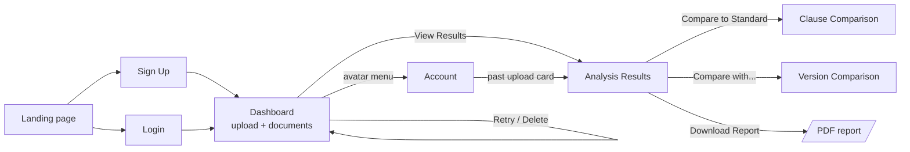

The storyboard went through two rounds: hand-drawn low-fidelity wireframes to agree on layout, then high-fidelity mockups that set the visual design. Screens without a mockup yet (Sign Up, Clause Comparison, Version Comparison) reuse the same components and are described below; mockups for them will be added during Sprint 2.

### Screen 1: Landing page

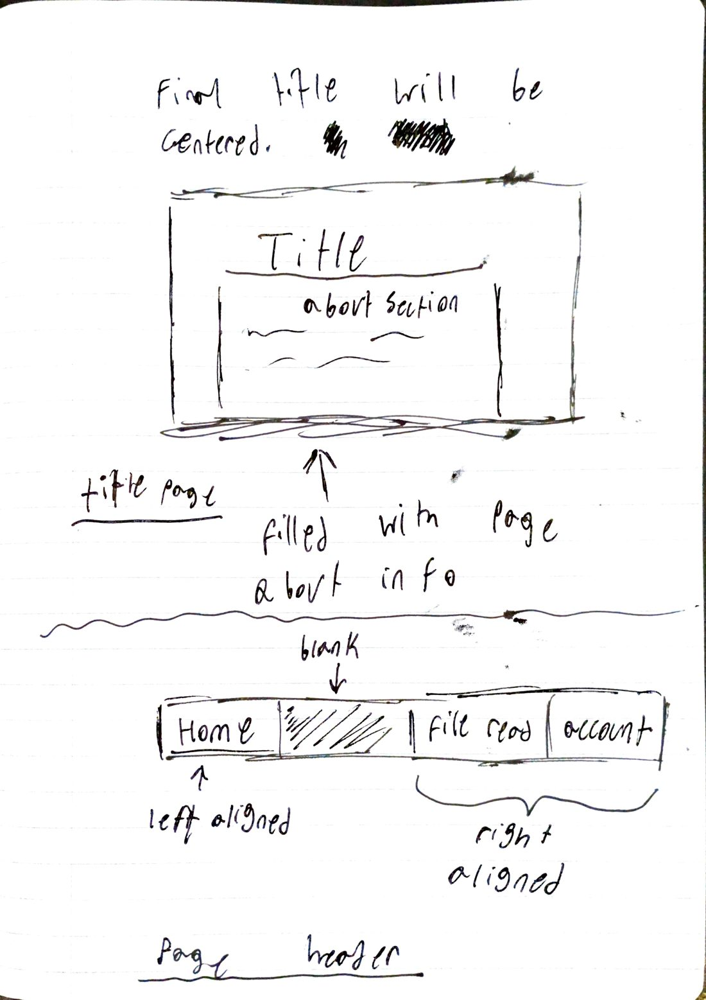

A centered title and "about" section explain what Clausify does, with a call to action to sign up. The header places **Home** on the left and **File Read** (Dashboard) and **Account** on the right. The legal disclaimer appears in the footer. *(FR-1, FR-2)*

### Screen 2: Login

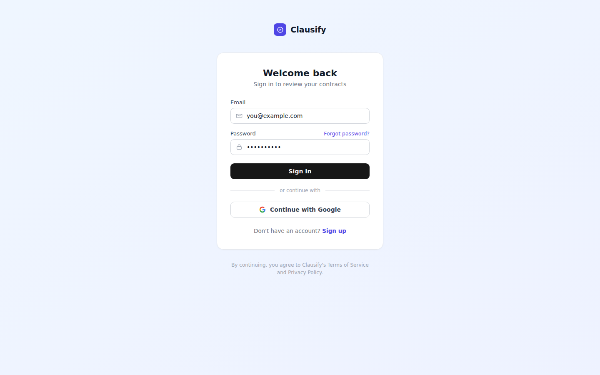

Email and password fields with inline validation, a link to Sign Up, and a Forgot password link. The **Continue with Google** button in the mockup is a future enhancement and will be hidden in the MVP. The **Sign Up** screen uses the same card with a Name field added. *(FR-1, FR-2)*

### Screen 3: Dashboard (upload and documents)

<p>
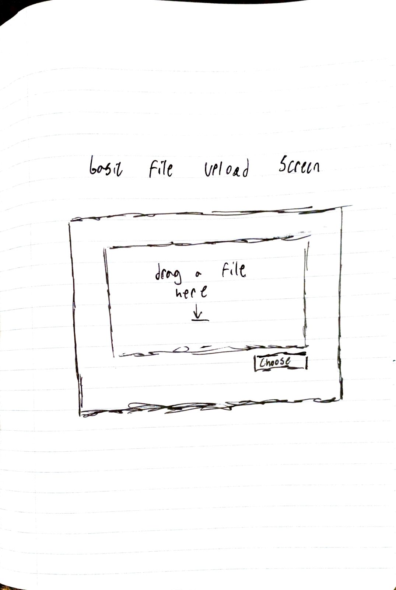
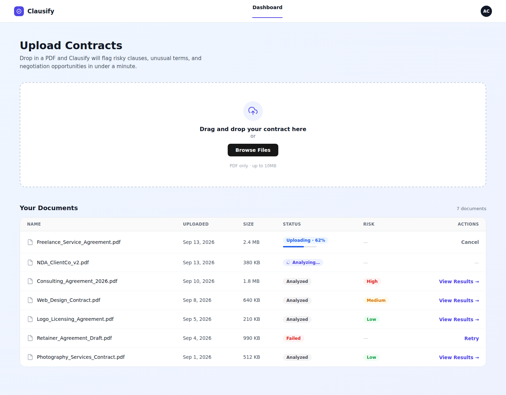
</p>

The home screen after sign-in. The upload zone accepts drag and drop or **Browse Files** (PDF only, up to 10 MB). "Your Documents" lists every contract with its status badge and risk level. Rows update automatically while analysis runs; Analyzed rows link to results and Failed rows offer **Retry**. *(FR-3, FR-4, FR-7, FR-8)*

### Screen 4: Analysis Results

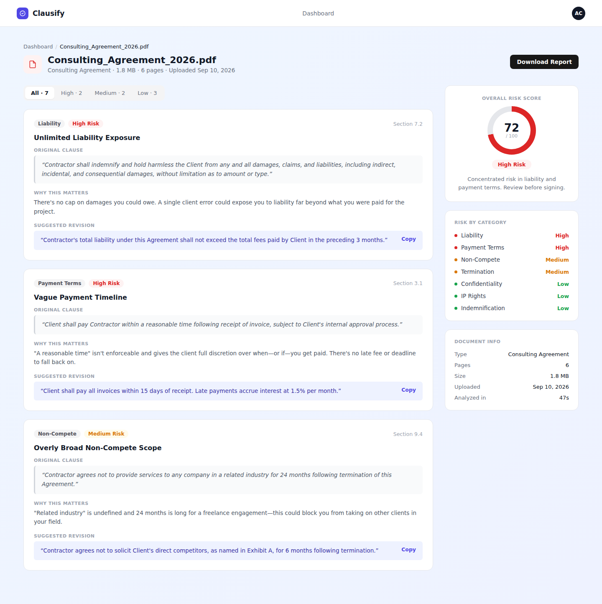

The main value screen. The right column shows the overall risk gauge, risk by category, and document info. The main column lists findings with filter chips (All, High, Medium, Low); each card shows the category, risk badge, section reference, the original clause, "Why this matters," and a suggested revision with **Copy**. Each card will also get a **Compare to Standard** link, and the header gets **Compare with...** next to **Download Report**. A "What's in your favor" section lists favorable clauses below the risky ones. *(FR-5, FR-6, FR-9, FR-10, FR-11)*

### Screen 5: Clause Comparison (planned)

A side-by-side view: the user's clause on the left and the three most similar standard clauses on the right, each with a similarity percentage and a Favorable or Unfavorable label, plus the recommendation from the finding. *(FR-9)*

### Screen 6: Version Comparison (planned)

A two-column diff of the original and revised text with additions and removals highlighted, an AI summary of the changes at the top, and the before and after risk scores. *(FR-10)*

### Screen 7: Account

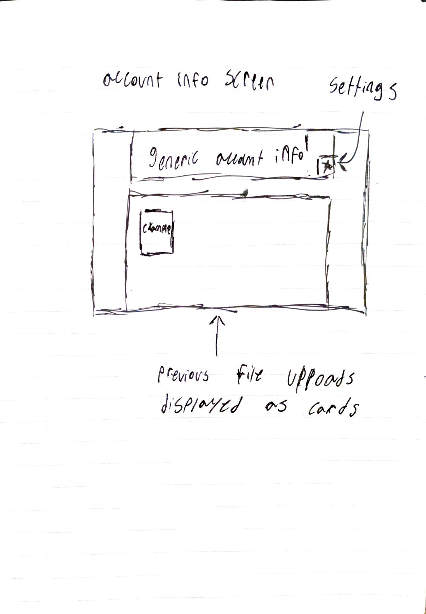

General account information with a settings control to edit the profile, statistics (contracts analyzed, average risk score), and previous uploads displayed as cards that link to their results. *(FR-12)*

---

## 6. Class Diagram

The backend is organized **package by feature** under `com.clausify`. Diagrams are split in two for readability: the domain model (JPA entities that map to tables) and the application layer (controllers, services, and integrations). Getters, setters, and constructors generated by Lombok are omitted.

### 6.1 Domain model

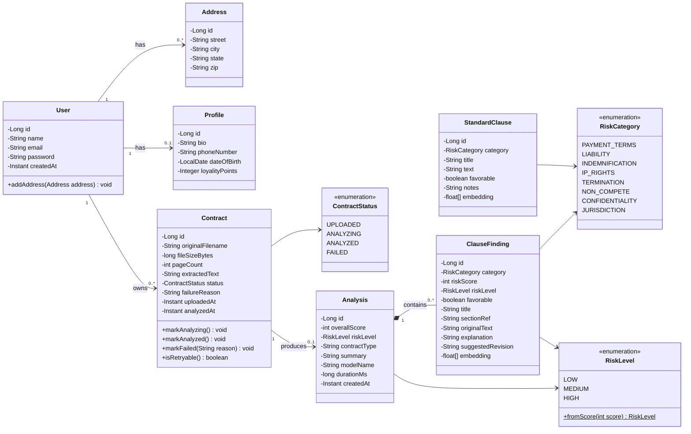

### 6.2 Application layer

```mermaid
classDiagram
    direction TB

    class AuthController {
        +register(RegisterRequest req) AuthResponse
        +login(LoginRequest req) AuthResponse
        +me(Jwt principal) UserResponse
    }
    class AuthService {
        +register(RegisterRequest req) AuthResponse
        +login(LoginRequest req) AuthResponse
    }
    class JwtService {
        +issueToken(User user) String
    }
    class SecurityConfig {
        +securityFilterChain(HttpSecurity http) SecurityFilterChain
        +passwordEncoder() PasswordEncoder
        +jwtEncoder() JwtEncoder
        +jwtDecoder() JwtDecoder
    }
    class UserController {
        +stats(Jwt principal) UserStatsResponse
        +update(Jwt principal, UpdateProfileRequest req) UserResponse
    }
    class UserService {
        +getStats(Long userId) UserStatsResponse
        +updateProfile(Long userId, UpdateProfileRequest req) UserResponse
    }

    class ContractController {
        +upload(MultipartFile file, Jwt principal) ResponseEntity
        +list(Jwt principal, Pageable page) Page
        +get(Long id, Jwt principal) ContractDetailResponse
        +delete(Long id, Jwt principal) void
        +retry(Long id, Jwt principal) ResponseEntity
        +getAnalysis(Long id, Jwt principal) AnalysisResponse
        +report(Long id, Jwt principal) ResponseEntity
        +compare(Long id, Long otherId, Jwt principal) ComparisonResponse
    }
    class ContractService {
        +upload(MultipartFile file, Long userId) ContractSummaryResponse
        +findOwned(Long id, Long userId) Contract
        +delete(Long id, Long userId) void
        +retry(Long id, Long userId) void
    }
    class PdfTextExtractor {
        +extract(byte[] pdf) ExtractedDocument
    }
    class ContractUploadedEvent {
        <<record>>
        +Long contractId
    }
    class AnalysisService {
        +onContractUploaded(ContractUploadedEvent event) void
        +runAnalysis(Long contractId) void
    }
    class ContractAnalyzer {
        <<interface>>
        +analyze(String contractText) AnalysisResult
    }
    class GroqContractAnalyzer {
        -ChatClient chatClient
        +analyze(String contractText) AnalysisResult
    }
    class RiskScorer {
        +overallScore(List findings) int
    }

    class ClauseController {
        +similar(Long findingId, Jwt principal) List
        +library(RiskCategory category) List
    }
    class ClauseSimilarityService {
        +findSimilar(Long findingId, Long userId, int limit) List
    }
    class EmbeddingService {
        -EmbeddingModel model
        +embed(String text) float[]
        +cosine(float[] a, float[] b)$ double
    }
    class StandardClauseLoader {
        +run(ApplicationArguments args) void
    }
    class ComparisonService {
        +compare(Long id, Long otherId, Long userId) ComparisonResponse
    }
    class ReportService {
        +render(Long contractId, Long userId) byte[]
    }
    class GlobalExceptionHandler {
        <<RestControllerAdvice>>
        +handleNotFound(NotFoundException ex) ProblemDetail
        +handleValidation(MethodArgumentNotValidException ex) ProblemDetail
        +handleUnreadablePdf(UnreadablePdfException ex) ProblemDetail
    }

    class UserRepository {
        <<interface>>
    }
    class ContractRepository {
        <<interface>>
    }
    class AnalysisRepository {
        <<interface>>
    }
    class StandardClauseRepository {
        <<interface>>
    }
    class JpaRepository {
        <<interface>>
    }

    AuthController ..> AuthService
    AuthService ..> UserRepository
    AuthService ..> JwtService
    UserController ..> UserService
    UserService ..> UserRepository
    UserService ..> ContractRepository

    ContractController ..> ContractService
    ContractController ..> ReportService
    ContractController ..> ComparisonService
    ContractService ..> PdfTextExtractor
    ContractService ..> ContractRepository
    ContractService ..> ContractUploadedEvent : publishes
    AnalysisService ..> ContractUploadedEvent : listens
    AnalysisService ..> ContractAnalyzer
    AnalysisService ..> RiskScorer
    AnalysisService ..> EmbeddingService
    AnalysisService ..> AnalysisRepository
    ContractAnalyzer <|.. GroqContractAnalyzer

    ClauseController ..> ClauseSimilarityService
    ClauseSimilarityService ..> EmbeddingService
    ClauseSimilarityService ..> StandardClauseRepository
    StandardClauseLoader ..> EmbeddingService
    StandardClauseLoader ..> StandardClauseRepository
    ComparisonService ..> ContractAnalyzer
    ReportService ..> AnalysisRepository

    JpaRepository <|-- UserRepository
    JpaRepository <|-- ContractRepository
    JpaRepository <|-- AnalysisRepository
    JpaRepository <|-- StandardClauseRepository
```

### 6.3 Class descriptions

**Domain (entities and enums)**

| Class | Package | Description |
|---|---|---|
| `User` | `user` | JPA entity for the `users` table from the Flyway lab; the account owner. Its `password` column stores the BCrypt hash. |
| `Address` | `user` | Lab entity, many per user (`@ManyToOne`). Kept for the course lab; not used by Clausify screens. |
| `Profile` | `user` | Lab entity sharing its primary key with `User` (`@MapsId`); holds optional bio and phone number shown on the Account page. |
| `Contract` | `contract` | An uploaded contract: metadata, extracted text, and a status. Owns its state transitions (`markAnalyzing`, `markFailed`) so the rules live in one place. |
| `ContractStatus` | `contract` | Enum for the analysis lifecycle: `UPLOADED → ANALYZING → ANALYZED` or `FAILED`. |
| `Analysis` | `analysis` | One-to-one with a contract; stores the overall score, level, inferred contract type, summary, model name, and duration. |
| `ClauseFinding` | `analysis` | One risky or favorable clause identified by the AI, with its explanation, suggested revision, and embedding vector. |
| `StandardClause` | `clause` | A reference clause in the standard library, labeled favorable or unfavorable, with its embedding. |
| `RiskCategory` | `analysis` | Enum of the 8 clause categories analyzed (the 7 from the proposal plus Indemnification, which appears in the mockups). |
| `RiskLevel` | `analysis` | Enum `LOW`, `MEDIUM`, `HIGH` with a static `fromScore` helper so thresholds are defined once. |

**Controllers (web layer)**

| Class | Description |
|---|---|
| `AuthController` | REST controller for `/api/auth/**`: register, login, and current user. |
| `UserController` | REST controller for `/api/users/me`: statistics and profile updates. |
| `ContractController` | REST controller for `/api/contracts/**`: upload, list, detail, delete, retry, analysis, report, and version comparison. Thin: validates input and delegates to services. |
| `ClauseController` | REST controller for similar-clause lookup and the standard clause library. |
| `GlobalExceptionHandler` | `@RestControllerAdvice` that turns exceptions into consistent RFC 9457 `ProblemDetail` JSON errors. |

**Services and components (business layer)**

| Class | Description |
|---|---|
| `AuthService` | Registers users (BCrypt hashing, duplicate-email check) and authenticates logins. |
| `JwtService` | Issues signed, expiring JWTs with Spring Security's `JwtEncoder`. |
| `SecurityConfig` | `@Configuration` for a stateless filter chain, public vs. protected routes, CORS, the password encoder, and the JWT encoder and decoder (Spring's OAuth2 resource server validates tokens, so no custom filter is needed). |
| `UserService` | Profile updates and account statistics. |
| `ContractService` | Upload workflow (validate, extract, save, publish event), ownership-scoped lookups, delete, and retry. |
| `PdfTextExtractor` | Wraps Apache PDFBox to pull text and page count from in-memory bytes; throws `UnreadablePdfException` for scanned or encrypted files. |
| `ContractUploadedEvent` | Java record published after an upload or retry; decouples uploading from analyzing. |
| `AnalysisService` | Listens for the event after the transaction commits, runs analysis on a background thread (`@Async`), saves results, and manages status transitions. |
| `ContractAnalyzer` | **Interface** for "give me findings for this text." Lets tests use a fake analyzer and lets the team swap LLM providers without touching the service. |
| `GroqContractAnalyzer` | `ContractAnalyzer` implementation that calls Groq through Spring AI's `ChatClient` and maps the JSON response to `AnalysisResult`. |
| `RiskScorer` | Computes the overall 0 to 100 score from findings with a fixed, unit-tested formula. |
| `EmbeddingService` | Wraps Spring AI's `EmbeddingModel` (local ONNX `all-MiniLM-L6-v2`) and provides cosine similarity. |
| `ClauseSimilarityService` | Finds the most similar standard clauses for a finding within the same category. |
| `StandardClauseLoader` | `ApplicationRunner` that computes embeddings at startup for any seeded standard clause that lacks one. |
| `ComparisonService` | Diffs two contracts' text (java-diff-utils), asks the analyzer for a change summary, and reports the score change. |
| `ReportService` | Renders the analysis into a downloadable PDF with PDFBox. |

**Repositories (data layer)**

| Interface | Description |
|---|---|
| `UserRepository` | Spring Data JPA repository; adds `findByEmail` and `existsByEmail`. |
| `ContractRepository` | Adds ownership-scoped queries: `findByIdAndUserId`, `findAllByUserId(Pageable)`. |
| `AnalysisRepository` | Loads an analysis with its findings in one query (`@EntityGraph`) to avoid the N+1 problem. |
| `StandardClauseRepository` | `findAllByCategory` for similarity search and the library screen. |

**DTOs (API boundary).** Requests and responses are Java `record`s validated with Bean Validation, for example `RegisterRequest`, `LoginRequest`, `AuthResponse`, `ContractSummaryResponse`, `ContractDetailResponse`, `AnalysisResponse`, `ClauseFindingResponse`, `SimilarClauseResponse`, `ComparisonResponse`, `UserStatsResponse`, and `UpdateProfileRequest`. Entities are never returned directly from controllers.

---

## 7. Architecture and Components

### 7.1 System architecture

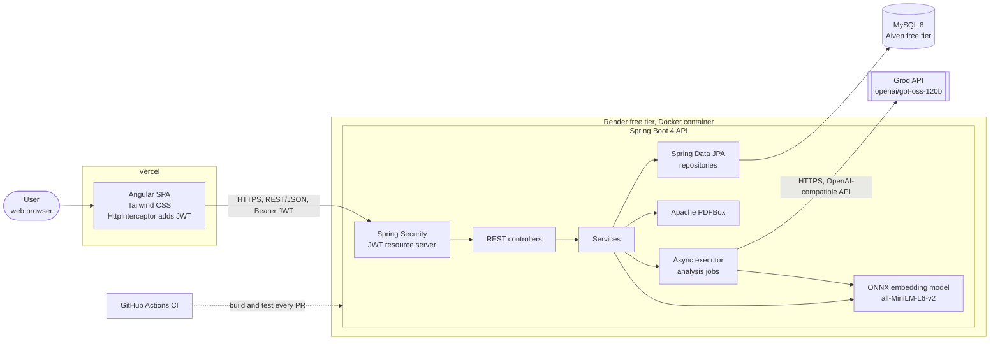

| Component | Technology | Responsibility |
|---|---|---|
| Web client | Angular, TypeScript, Tailwind CSS | All screens; route guards for signed-in pages; an `HttpInterceptor` attaches the JWT; polls contract status while analysis runs. |
| API | Spring Boot 4.1, Java 21, Maven | REST endpoints, validation, security, business logic, background jobs. |
| Security | Spring Security, BCrypt, JWT (HS256) | Stateless authentication; every contract query is scoped to the token's user. |
| Persistence | Spring Data JPA, Hibernate, Flyway | Entity mapping; versioned schema migrations; `ddl-auto: validate` so the schema only changes through Flyway. |
| Database | MySQL 8 (Docker locally, Aiven in production) | Users, contracts (text only), analyses, findings, standard clauses, embeddings. |
| Document processing | Apache PDFBox | Text extraction on upload; PDF report generation. |
| AI analysis | Groq via Spring AI OpenAI starter | Structured JSON findings for each contract. |
| Embeddings | Spring AI ONNX Transformers (runs inside the API) | 384-dimension vectors for similarity; no external calls, no API key. |
| CI | GitHub Actions | Build and run all tests on every pull request; required to pass before merge. |
| API docs | springdoc-openapi | Swagger UI at `/swagger-ui.html`. |

### 7.2 Request flow: upload to results

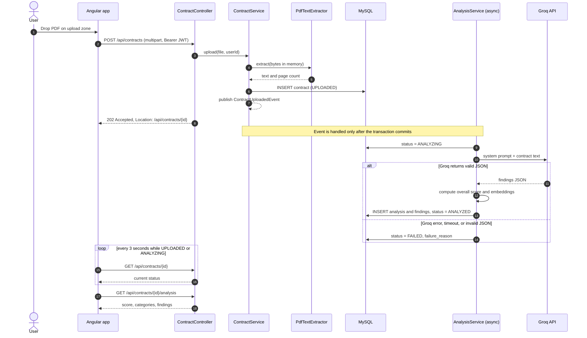

Three low-level choices in this flow:

1. **The PDF is never stored.** Text is extracted from the in-memory upload inside the request, and only the text is saved. Retry, comparison, and reports all work from that text.
2. **The API returns 202 immediately.** Analysis can take up to a minute, far longer than an HTTP request should stay open, so it runs on a dedicated thread pool and the client polls for status.
3. **Analysis starts after commit.** `AnalysisService` uses `@TransactionalEventListener(phase = AFTER_COMMIT)` plus `@Async`, so the background thread never tries to load a contract row that has not been committed yet.

### 7.3 Layers and packages

Requests always flow **Controller → Service → Repository**. Controllers stay thin, services hold business rules and transactions, and repositories only persist data. DTOs are used at the API boundary so entities never leak into JSON.

```
backend/src/main/java/com/clausify/
├── ClausifyBackendApplication.java
├── user/        User, Address, Profile, repositories, AuthController, AuthService,
│                JwtService, UserController, UserService, DTOs
├── contract/    Contract, ContractStatus, ContractController, ContractService,
│                PdfTextExtractor, ContractUploadedEvent, ComparisonService, ReportService
├── analysis/    Analysis, ClauseFinding, RiskCategory, RiskLevel, AnalysisService,
│                ContractAnalyzer, GroqContractAnalyzer, RiskScorer, prompt templates
├── clause/      StandardClause, ClauseController, ClauseSimilarityService,
│                EmbeddingService, StandardClauseLoader, seed data
├── config/      SecurityConfig, AsyncConfig, AiConfig, OpenApiConfig, CorsConfig
└── common/      GlobalExceptionHandler, NotFoundException, UnreadablePdfException
```

Package by feature (rather than one `controllers/` and one `services/` folder) keeps everything for a feature together, so each team member can own a folder with fewer merge conflicts.

### 7.4 REST API

| Method | Endpoint | Auth | Success | Purpose | FR |
|---|---|---|---|---|---|
| POST | `/api/auth/register` | Public | 201 | Create account, return JWT | FR-1 |
| POST | `/api/auth/login` | Public | 200 | Sign in, return JWT | FR-2 |
| GET | `/api/auth/me` | JWT | 200 | Current user | FR-2 |
| POST | `/api/contracts` | JWT | 202 | Upload PDF (multipart, max 10 MB) | FR-3 |
| GET | `/api/contracts` | JWT | 200 | My contracts, paginated, newest first | FR-4 |
| GET | `/api/contracts/{id}` | JWT | 200 | Contract detail and status | FR-4 |
| DELETE | `/api/contracts/{id}` | JWT | 204 | Delete contract and all derived data | FR-8 |
| POST | `/api/contracts/{id}/retry` | JWT | 202 | Re-run a failed analysis | FR-7 |
| GET | `/api/contracts/{id}/analysis` | JWT | 200 | Score, categories, findings | FR-5, FR-6 |
| GET | `/api/clauses/{findingId}/similar` | JWT | 200 | Top 3 similar standard clauses | FR-9 |
| GET | `/api/standard-clauses` | JWT | 200 | Standard clause library, filter by category | FR-9 |
| POST | `/api/contracts/{id}/compare/{otherId}` | JWT | 200 | Version comparison | FR-10 |
| GET | `/api/contracts/{id}/report` | JWT | 200 | PDF report download | FR-11 |
| GET | `/api/users/me/stats` | JWT | 200 | Contracts analyzed, average risk | FR-12 |
| PATCH | `/api/users/me` | JWT | 200 | Update name and profile | FR-12 |

Errors use RFC 9457 `ProblemDetail` JSON: `400` validation, `401` missing or invalid token, `404` not found **or not owned by the caller**, `409` duplicate email or invalid state change, `413` file too large, `415` not a PDF, `422` unreadable PDF.

### 7.5 Database

The schema is created only through Flyway migrations. V1 to V3 come from the graded Flyway lab and are never edited; new tables are added as new versions.

| Migration | Tables | Notes |
|---|---|---|
| V1 to V3 (lab) | `users`, `addresses`, `profiles` | `users.password` stores the BCrypt hash. |
| V4 | `users` | Unique index on `email`, `created_at` column. |
| V5 | `contracts` | FK `user_id` with `ON DELETE CASCADE`; index on `(user_id, uploaded_at)`; `extracted_text` as `MEDIUMTEXT`. |
| V6 | `analyses`, `clause_findings` | `analyses.contract_id` unique (one-to-one); findings cascade on delete; `embedding` stored as JSON. |
| V7 | `standard_clauses` | Seeded with the reviewed standard clause library. |

All IDs are `BIGINT AUTO_INCREMENT`, matching the lab's `users` table.

### 7.6 Risk scoring

The model scores each clause (0 to 100), but the **overall score is computed in Java**, not by the model, so it is consistent and unit-testable:

- Using only the non-favorable findings: `overall = round(0.6 × highest score + 0.4 × average score)`. Weighting the highest score means one severe clause cannot be averaged away by many mild ones.
- If there are no non-favorable findings, the overall score is 0.
- Levels: **Low** below 40, **Medium** 40 to 69, **High** 70 and above.

Example: findings of 85, 78, 55 (risky) and 20 (favorable) give `0.6 × 85 + 0.4 × 72.7 = 80`, which is **High**.

### 7.7 AI analysis contract

`GroqContractAnalyzer` sends a system prompt that defines the 8 categories, the scoring scale, and a required JSON shape, then the contract text. Spring AI maps the reply to a Java record, and invalid output fails the analysis cleanly (status `FAILED`) instead of saving partial data.

```json
{
  "contractType": "Consulting Agreement",
  "summary": "Concentrated risk in liability and payment terms.",
  "findings": [
    {
      "category": "LIABILITY",
      "riskScore": 85,
      "favorable": false,
      "title": "Unlimited Liability Exposure",
      "sectionRef": "Section 7.2",
      "originalText": "Contractor shall indemnify and hold harmless the Client from any and all damages...",
      "explanation": "There is no cap on damages you could owe.",
      "suggestedRevision": "Contractor's total liability shall not exceed the fees paid in the preceding 3 months."
    }
  ]
}
```

Similarity search embeds each finding's original text and every standard clause with the same local model, then ranks standard clauses **in the same category** by cosine similarity and returns the top 3 (shown as a percentage).

### 7.8 Security and quality

- **Authentication:** BCrypt (strength 10) for passwords; HS256 JWT with a 24-hour expiry; the signing secret comes from an environment variable.
- **Authorization:** every contract lookup includes the caller's user ID (`findByIdAndUserId`), so users can never read or modify another user's data.
- **Input validation:** Bean Validation on every request DTO; upload checks both the content type and the `%PDF` file signature.
- **Secrets:** Groq key, database credentials, and JWT secret live only in environment variables; `.env` is git-ignored and `.env.example` documents each variable.
- **Testing:** unit tests (JUnit 5, Mockito) for services and `RiskScorer`; `@WebMvcTest` slice tests for controllers; integration tests against real MySQL with Testcontainers; a fake `ContractAnalyzer` keeps tests fast and free of Groq calls; JaCoCo enforces the coverage target in CI.
- **Deployment:** the API ships as a Docker image to Render; Angular deploys to Vercel. Free tiers sleep when idle, so both are woken before demos.

---

## 8. Scrum Roles and Responsibilities


| Role | Member | Responsibilities |
|---|---|---|
| **Product Owner** | Kymani Jarrett | Owns and prioritizes the Product Backlog; writes and refines user stories and acceptance criteria; accepts or rejects completed stories at Sprint Review. |
| **Scrum Master** | Ashton Cashier | Runs Sprint Planning, check-ins, Review, and Retrospective; decides with the team which stories are played each sprint; keeps the GitHub Project board current; removes blockers. |
| **Developers** | All four members | Break stories into technical tasks, estimate, build, test, and review each other's pull requests. Every member works full stack on the features they own. |

### Ownership areas

Each developer owns one feature area end to end: its backend package, its tests, and its Angular screens in Sprint 2. Owners review changes to their area. Assignments may be rebalanced at Sprint Planning.

| Area | Backend package | Screens | Owner |
|---|---|---|---|
| Accounts and security | `user/`, `config/SecurityConfig` | Landing, Login, Sign Up, Account | Kymani Jarrett |
| Contracts and documents | `contract/` (upload, list, delete, retry, report) | Dashboard | Ashton Cashier |
| AI analysis | `analysis/` (Groq integration, prompts, scoring) | Analysis Results | Rival Young |
| Clause library and comparison | `clause/`, `ComparisonService` | Clause Comparison, Version Comparison | Venkat Yuva Raaj Narra |

Cross-cutting duties are shared and rotate each sprint: CI and deployment, documentation and ADRs, and the final presentation.

### Process

- **Sprints:** three two-week sprints, each matching a GitHub milestone (see Section 9).
- **Events:** Sprint Planning at the start of each sprint; short check-ins three times a week; Sprint Review and Retrospective at the end.
- **Workflow:** one branch per task, a pull request for every change, at least one approving review from a teammate, CI must pass, then merge into `main` with a merge commit titled by the PR title.
- **Definition of Done:** code merged to `main`, acceptance criteria met, tests written and passing, no new warnings in CI, API documented in Swagger, and the issue closed on the board.

---

## 9. GitHub Project Links

- **Repository:** https://github.com/kymanirjarrett/clausify
- **Project board:** TODO (add the GitHub Project URL)
- **Milestones:** https://github.com/kymanirjarrett/clausify/milestones

| Milestone | Dates | Goal |
|---|---|---|
| **Milestone #1: Sprint 1** | Sep 28 to Oct 11, 2026 | Backend foundation: authentication, contract upload with text extraction, AI analysis with status tracking, retry and delete, API docs. |
| **Milestone #2: Sprint 2** | Oct 12 to Oct 25, 2026 | Clause similarity, standard clause library, version comparison, PDF report, and the Angular frontend for every screen. |
| **Milestone #3: Sprint 3** | Oct 26 to Nov 8, 2026 | Account page, test coverage to 80%, deployment to Render, Vercel, and Aiven, documentation, and the final presentation. |

Sprint 1 stories and technical tasks are tracked on the project board and linked to Milestone #1.
