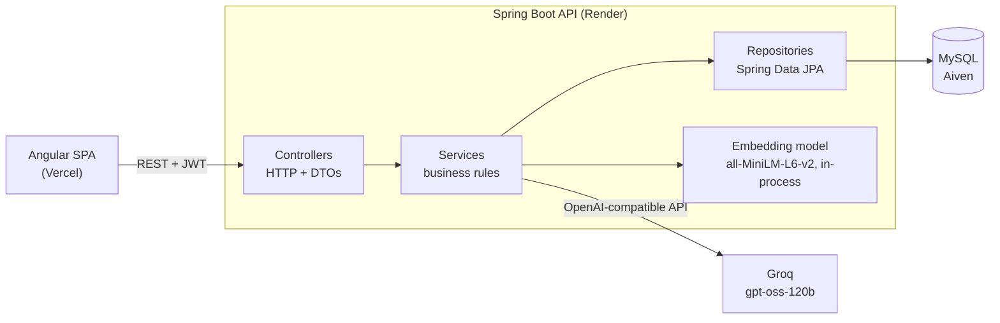

# Clausify 📄

> AI-Powered Contract Analysis Platform for Freelancers

[](https://github.com/kymanirjarrett/clausify/actions/workflows/ci.yml)

**Design document:** [DESIGN.md](DESIGN.md)

Clausify helps freelancers and small business owners understand legal contracts by using AI to identify risky clauses, suggest negotiation points, and compare terms against industry standards.

## 🚀 Features (planned)

Clausify is being rebuilt from a Next.js prototype into a Spring Boot + Angular application. Target features:

- **AI risk analysis:** upload a contract PDF and get an overall risk score (High / Medium / Low) plus flagged clauses across eight categories: payment terms, liability, IP rights, termination, non-compete, confidentiality, jurisdiction, and indemnification
- **Negotiation suggestions:** concrete revisions for unfavourable clauses
- **Standard-clause comparison:** semantic similarity against a library of standard contract terms
- **Privacy by design:** the PDF is never stored; only its extracted text is kept
- **Zero cost:** runs entirely on free tiers

## 🛠️ Tech stack

| Layer | Technology |
|---|---|
| Frontend | Angular 22 (standalone, zoneless, signals), TypeScript, Tailwind CSS v4 |
| Backend | Java 21, Spring Boot 4.1, Spring Web, Spring Data JPA (Hibernate 7), Spring Security, Lombok, Maven |
| Database | MySQL: Docker locally, Aiven free tier when deployed |
| Migrations | Flyway |
| AI | Groq `openai/gpt-oss-120b` through Spring AI's OpenAI starter |
| Embeddings | `all-MiniLM-L6-v2` via Spring AI ONNX Transformers, running inside the API |
| PDF | Apache PDFBox |
| Auth | BCrypt passwords, stateless JWT |
| Hosting | Vercel (frontend), Render (API, Docker) |
| CI | GitHub Actions |

Each choice and its trade-offs are recorded in the [architecture decision records](docs/adr/). The original prototype used Next.js, Supabase (Postgres + pgvector), and Supabase Storage; its code is kept for reference in [`legacy/nextjs-prototype/`](legacy/nextjs-prototype/) until the Angular app replaces it.

## 🏛️ Architecture



- **Controllers** only translate HTTP requests into service calls and return DTOs, never database entities.
- **Services** hold the business rules: ownership checks, the contract status lifecycle, and calls to Groq and the embedding model.
- **Repositories** are Spring Data JPA interfaces; **Flyway** owns the schema and Hibernate only validates it.
- **Upload flow:** the API extracts text from the PDF in memory, stores the text, returns `202 Accepted`, and analyses it in the background (`UPLOADED → ANALYZING → ANALYZED / FAILED`). See [ADR 0005](docs/adr/0005-extract-text-do-not-store-pdfs.md).
- **Similarity search** runs in Java over cached embeddings, because MySQL Community cannot compare vectors. See [ADR 0003](docs/adr/0003-mysql-with-java-cosine-similarity.md).

## 💻 Local setup

### Prerequisites

- JDK 21 or newer
- [Docker Desktop](https://www.docker.com/products/docker-desktop/)
- Node.js LTS (includes npm), for the frontend
- Git

### Run

```bash
git clone https://github.com/kymanirjarrett/clausify.git
cd clausify
docker compose up -d                  # MySQL 8.4 on localhost:3307
cd backend
./mvnw spring-boot:run                # API on http://localhost:8080
```

In a second terminal, start the web app:

```bash
cd frontend
npm install                           # first time only
npm start                             # http://localhost:4200, proxies /api to the API on 8080
```

Open **http://localhost:4200**, create an account, and upload a contract PDF. Sample contracts are in [`backend/src/test/resources/contracts/`](backend/src/test/resources/contracts/).

The API starts with the `local` Spring profile, which points at the Docker database and needs no environment variables. Flyway creates the schema on startup.

### Test

```bash
cd backend
./mvnw verify                         # compile, run all tests, coverage report (Docker must be running)
cd ../frontend
npx ng test --watch=false             # frontend unit tests (Vitest)
```

### Configuration

| Profile | Used for | Settings |
|---|---|---|
| `local` (default) | Development | [`application-local.yml`](backend/src/main/resources/application-local.yml): Docker MySQL, no env vars |
| `prod` | Deployed API | [`application-prod.yml`](backend/src/main/resources/application-prod.yml): every value from environment variables |

Every environment variable the deployed API needs is listed with a placeholder in [`.env.example`](.env.example). Real values never go in git.

### API documentation

With the API running, open **http://localhost:8080/swagger-ui.html** to browse and call every endpoint (the raw OpenAPI spec is at `/v3/api-docs`). To call protected endpoints, use **register** or **login**, copy the `token` from the response, click **Authorize**, and paste it.

## 🤝 Contributing

Team workflow (issues, branch names, Conventional Commits, PR checks, reviews, lab tagging) is in [CONTRIBUTING.md](CONTRIBUTING.md). Every PR runs the backend tests (against MySQL) and the frontend tests and production build in GitHub Actions.

## 🗺️ Roadmap

- [x] Spring Boot backend with Flyway migrations (course lab)
- [x] Local and deployed configuration, CI, architecture decision records
- [x] Authentication: register, login, JWT
- [x] Contract upload with in-memory text extraction, contract list and detail
- [ ] AI analysis with Groq, risk scoring, flagged clauses
- [ ] Standard-clause similarity search
- [x] Angular frontend: landing, sign-up and login, dashboard with upload, contract detail, account
- [ ] Deployment (Render, Vercel, Aiven)

## 👥 Team

Kymani Jarrett, Ashton Cashier, Venkat Yuva Raaj Narra, Rival Young.

## 🎓 Course submissions

Enterprise Application Development (IT4045C), University of Cincinnati, Fall 2026. Each submission is marked with a git tag, so the graded state stays viewable after later commits.

| Lab | Tag | Key paths |
|---|---|---|
| Flyway migrations + Lombok entities | [`lab-flyway-mysql`](https://github.com/kymanirjarrett/clausify/tree/lab-flyway-mysql) | [`backend/src/main/resources/db/migration/`](backend/src/main/resources/db/migration/), [`backend/src/main/java/com/clausify/user/`](backend/src/main/java/com/clausify/user/) |
| Design document + GitHub project board | [`design-doc`](https://github.com/kymanirjarrett/clausify/tree/design-doc) | [`DESIGN.md`](DESIGN.md), [`docs/design/`](docs/design/), [project board](https://github.com/users/kymanirjarrett/projects/6), [milestones](https://github.com/kymanirjarrett/clausify/milestones) |

## ⚖️ Legal disclaimer

**IMPORTANT**: Clausify is an AI-powered tool designed to assist with contract review. It is NOT a substitute for professional legal advice.

- The analysis provided is for informational purposes only
- Always consult with a licensed attorney for legal matters
- No attorney-client relationship is created by using this tool
- The creators are not lawyers and this is not legal advice

## 📧 Contact

- GitHub Issues: [github.com/kymanirjarrett/clausify/issues](https://github.com/kymanirjarrett/clausify/issues)
- Email: [jarretkr@mail.uc.edu](mailto:jarretkr@mail.uc.edu)
